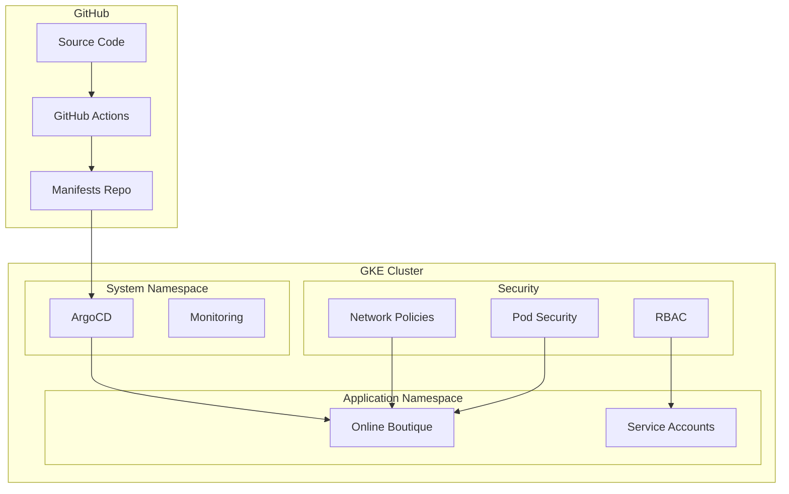

# Online Boutique Enhancement Plan

## 🎯 Vision
Transform the basic Online Boutique deployment into an enterprise-grade, GitOps-enabled microservices platform with proper RBAC, CI/CD automation, and observability.

## 📋 Enhancement Goals

### 1. **RBAC & Security** 🔐
- Implement proper Kubernetes RBAC with service accounts
- Add network policies for micro-segmentation
- Configure pod security standards
- Set up least-privilege access patterns

### 2. **CI/CD Automation** ⚙️
- GitHub Actions workflows for infrastructure
- Automated testing and validation
- Container image building and scanning
- GitOps integration

### 3. **GitOps with ArgoCD** 🔄
- ArgoCD deployment and configuration
- Application-of-applications pattern
- Multi-environment promotion
- Declarative configuration management

### 4. **Observability & Monitoring** 📊
- Basic monitoring setup
- Log aggregation
- Health checks and alerting
- Performance tracking

## 🗺️ Implementation Roadmap

### Phase 1: Foundation & Security
**Duration: 2-3 days**

#### Task 1.1: RBAC Implementation
- [ ] Create Terraform module for RBAC resources
- [ ] Define service accounts for different components
- [ ] Implement role-based access control
- [ ] Add cluster roles and bindings
- [ ] Configure pod service accounts

#### Task 1.2: Security Enhancements
- [ ] Add network policies
- [ ] Implement pod security standards
- [ ] Configure resource quotas and limits
- [ ] Add basic security scanning

### Phase 2: CI/CD Pipeline
**Duration: 2-3 days**

#### Task 2.1: GitHub Actions Setup
- [ ] Infrastructure validation workflow
- [ ] Terraform plan/apply automation
- [ ] Security scanning integration
- [ ] Multi-environment support

#### Task 2.2: Container Pipeline
- [ ] Docker image building
- [ ] Image vulnerability scanning
- [ ] Registry integration
- [ ] Automated testing

### Phase 3: GitOps Implementation
**Duration: 3-4 days**

#### Task 3.1: ArgoCD Deployment
- [ ] ArgoCD Terraform module
- [ ] High-availability configuration
- [ ] RBAC integration
- [ ] SSL/TLS setup

#### Task 3.2: GitOps Structure
- [ ] Application manifest organization
- [ ] Environment-specific overlays
- [ ] App-of-apps pattern
- [ ] Sync policies and health checks

### Phase 4: Integration & Enhancement
**Duration: 2-3 days**

#### Task 4.1: CI/CD ↔ GitOps Integration
- [ ] Automated manifest updates
- [ ] Progressive deployment
- [ ] Rollback mechanisms
- [ ] Notification systems

#### Task 4.2: Observability
- [ ] Basic monitoring stack
- [ ] Log aggregation
- [ ] Health dashboards
- [ ] Alerting rules

## 🏗️ Enhanced Architecture



## 📁 New Directory Structure

```
microservices-demo/
├── .github/
│   └── workflows/           # GitHub Actions
├── argocd/
│   ├── apps/               # ArgoCD Applications
│   ├── projects/           # ArgoCD Projects
│   └── bootstrap/          # Bootstrap configs
├── gitops/
│   ├── base/               # Base Kustomize configs
│   ├── overlays/           # Environment overlays
│   │   ├── dev/
│   │   ├── staging/
│   │   └── prod/
│   └── apps/               # Application definitions
├── terraform/
│   └── src/modules/
│       ├── argocd/         # ArgoCD deployment
│       ├── rbac/           # RBAC resources
│       ├── monitoring/     # Basic monitoring
│       └── security/       # Security policies
└── docs/
    ├── gitops-workflow.md
    ├── rbac-guide.md
    └── cicd-setup.md
```

## 🔧 Technology Stack

### Infrastructure
- **Terraform**: Infrastructure as Code
- **GKE Autopilot**: Managed Kubernetes
- **Google Cloud**: Cloud platform

### GitOps & CI/CD
- **ArgoCD**: GitOps continuous delivery
- **GitHub Actions**: CI/CD automation
- **Kustomize**: Configuration management
- **Helm**: Package management (where needed)

### Security
- **Kubernetes RBAC**: Access control
- **Network Policies**: Micro-segmentation
- **Pod Security Standards**: Runtime security
- **Google Cloud Security**: Cloud-native security

### Monitoring (Basic)
- **GKE Monitoring**: Built-in observability
- **Prometheus**: Metrics collection
- **Grafana**: Visualization
- **Alertmanager**: Alert handling

## 🎯 Success Criteria

### Phase 1 Success
- [ ] All microservices run with dedicated service accounts
- [ ] Network policies restrict inter-pod communication
- [ ] RBAC prevents unauthorized access
- [ ] Security policies are enforced

### Phase 2 Success
- [ ] Infrastructure changes are automatically validated
- [ ] Terraform applies are automated and safe
- [ ] Container images are built and scanned
- [ ] Multi-environment deployments work

### Phase 3 Success
- [ ] ArgoCD manages all application deployments
- [ ] GitOps workflow enables declarative operations
- [ ] Applications sync automatically from Git
- [ ] Rollbacks are quick and reliable

### Phase 4 Success
- [ ] CI/CD triggers GitOps deployments
- [ ] Monitoring provides visibility
- [ ] Alerts notify of issues
- [ ] Documentation enables team adoption

## 🚦 Risk Mitigation

### Technical Risks
- **Complexity**: Incremental implementation
- **Breaking changes**: Feature flags and rollback plans
- **Security**: Gradual privilege reduction
- **Performance**: Load testing and monitoring

### Operational Risks
- **Learning curve**: Comprehensive documentation
- **Downtime**: Blue-green deployment strategies
- **Data loss**: Backup and recovery procedures
- **Access issues**: Emergency access procedures

## 📚 Learning Outcomes

By completing this enhancement, you'll gain hands-on experience with:
- Enterprise Kubernetes security patterns
- GitOps workflows and best practices
- CI/CD automation for infrastructure and applications
- Observability and monitoring setup
- Modern DevOps toolchain integration

---

**Next Steps**: Begin with Phase 1 - RBAC Implementation