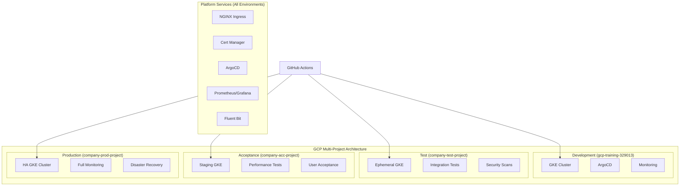
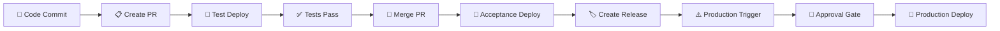

# 🏪 Online Boutique - Enterprise DTAP Pipeline

[](https://opensource.org/licenses/Apache-2.0)
[](https://www.terraform.io/)
[](https://kubernetes.io/)
[](https://cloud.google.com/)

A cloud-native microservices demo application deployed using enterprise-grade DTAP (Development, Test, Acceptance, Production) pipeline with GitHub Actions, Terraform, and Google Kubernetes Engine.

## 📋 Table of Contents

- [Overview](#overview)
- [Architecture](#architecture)
- [Quick Start](#quick-start)
- [Prerequisites](#prerequisites)
- [Environment Setup](#environment-setup)
- [Deployment Pipeline](#deployment-pipeline)
- [Local Development](#local-development)
- [Monitoring & Observability](#monitoring--observability)
- [Security & Compliance](#security--compliance)
- [Troubleshooting](#troubleshooting)
- [Contributing](#contributing)

## 🎯 Overview

This project demonstrates a complete enterprise microservices deployment pipeline featuring:

- **🏗️ Multi-Environment Architecture**: Separate GCP projects for isolation
- **🚀 GitOps Deployment**: ArgoCD for declarative deployments  
- **🔄 CI/CD Pipeline**: GitHub Actions with progressive deployment
- **📊 Observability Stack**: Prometheus, Grafana, and centralized logging
- **🔒 Enterprise Security**: Network policies, private clusters, RBAC
- **💰 Cost Optimization**: Environment-specific resource sizing

### Application Stack

The Online Boutique consists of 11 microservices written in different languages that talk to each other over gRPC:

| Service | Language | Description |
|---------|----------|-------------|
| **frontend** | Go | Exposes HTTP server to serve the website |
| **cartservice** | C# | Stores items in the user's shopping cart in Redis |
| **productcatalogservice** | Go | Provides the list of products from JSON file |
| **currencyservice** | Node.js | Converts one money amount to another currency |
| **paymentservice** | Node.js | Charges the given credit card info |
| **shippingservice** | Go | Gives shipping cost estimates |
| **emailservice** | Python | Sends users an order confirmation email |
| **checkoutservice** | Go | Retrieves cart, prepares order and orchestrates payment |
| **recommendationservice** | Python | Recommends other products based on what's in cart |
| **adservice** | Java | Provides text ads based on given context words |
| **loadgenerator** | Python/Locust | Continuously sends requests to frontend |

## 🏗️ Architecture

### DTAP Environment Strategy

```
┌─────────────────┬──────────────────┬─────────────────┬────────────────────┐
│   Development   │       Test       │   Acceptance    │    Production      │
├─────────────────┼──────────────────┼─────────────────┼────────────────────┤
│ • Local/Manual  │ • PR Triggered   │ • Merge Trigger │ • Manual Release   │
│ • Single Node   │ • Ephemeral      │ • Staging Env   │ • Multi-Zone HA    │
│ • Preemptible   │ • Cost Optimized │ • User Testing  │ • Production Grade │
│ • Quick Feedback│ • Full Test Suite│ • Performance   │ • Zero Downtime    │
└─────────────────┴──────────────────┴─────────────────┴────────────────────┘
```

### Infrastructure Components



## ⚡ Quick Start

### 1. Clone the Repository

```bash
git clone https://github.com/your-org/microservices-demo.git
cd microservices-demo
```

### 2. Set Up Development Environment

```bash
# Install prerequisites (macOS)
brew install terraform kubectl helm gcloud

# Authenticate with GCP
gcloud auth login
gcloud config set project gcp-training-329013

# Deploy development environment
cd terraform/dtap/dev
terraform init
terraform apply -auto-approve

# Get cluster credentials
gcloud container clusters get-credentials online-boutique-dev \
  --region europe-west4 --project gcp-training-329013
```

### 3. Verify Deployment

```bash
# Check cluster status
kubectl get nodes
kubectl get pods --all-namespaces

# Get application URL
kubectl get svc frontend-external --namespace default
```

### 4. Access Services

| Service | URL | Credentials |
|---------|-----|-------------|
| **Online Boutique** | `http://<EXTERNAL-IP>` | None required |
| **ArgoCD** | `https://argocd-dev.example.com` | admin / check k8s secret |
| **Grafana** | `https://grafana-dev.example.com` | admin / admin |

## 📋 Prerequisites

### Required Software

```bash
# Install on macOS
brew install terraform
brew install kubectl  
brew install helm
brew install gcloud

# Verify installations
terraform --version  # >= 1.5.0
kubectl version      # >= 1.27.0  
helm version         # >= 3.12.0
gcloud --version     # >= 400.0.0
```

### GCP Setup

1. **Create GCP Projects** (or use existing):
   ```bash
   # Development (existing)
   gcloud config set project gcp-training-329013
   
   # Test, Acceptance, Production (optional for demo)
   gcloud projects create company-test-project --name="Test Environment"
   gcloud projects create company-acc-project --name="Acceptance Environment"
   gcloud projects create company-prod-project --name="Production Environment"
   ```

2. **Enable Required APIs**:
   ```bash
   gcloud services enable container.googleapis.com
   gcloud services enable compute.googleapis.com
   gcloud services enable servicenetworking.googleapis.com
   gcloud services enable monitoring.googleapis.com
   gcloud services enable logging.googleapis.com
   ```

3. **Set up Terraform State Storage**:
   ```bash
   # Create Cloud Storage buckets for Terraform state
   gsutil mb gs://your-terraform-state-dev
   gsutil mb gs://your-terraform-state-test
   gsutil mb gs://your-terraform-state-acc
   gsutil mb gs://your-terraform-state-prod
   ```

### GitHub Setup (for CI/CD)

1. **Create Service Accounts**:
   ```bash
   # Development environment
   gcloud iam service-accounts create github-actions-dev \
     --display-name="GitHub Actions Dev" \
     --project=gcp-training-329013

   # Add required roles
   gcloud projects add-iam-policy-binding gcp-training-329013 \
     --member="serviceAccount:github-actions-dev@gcp-training-329013.iam.gserviceaccount.com" \
     --role="roles/container.admin"
   
   # Generate and download key
   gcloud iam service-accounts keys create ~/dev-key.json \
     --iam-account=github-actions-dev@gcp-training-329013.iam.gserviceaccount.com
   ```

2. **Configure GitHub Secrets**:
   ```
   Repository Settings → Secrets and variables → Actions
   
   Add secrets:
   - GCP_DEV_SA_KEY: <contents of dev-key.json>
   - GCP_TEST_SA_KEY: <test service account key>
   - GCP_ACC_SA_KEY: <acceptance service account key>  
   - GCP_PROD_SA_KEY: <production service account key>
   ```

## 🚀 Environment Setup

### Development Environment

```bash
cd terraform/dtap/dev

# Initialize Terraform
terraform init

# Review planned changes
terraform plan -var="gcp_project_id=gcp-training-329013"

# Apply configuration
terraform apply -auto-approve

# Configure kubectl
gcloud container clusters get-credentials online-boutique-dev \
  --region europe-west4 --project gcp-training-329013
```

### Test Environment (CI/CD)

The test environment is automatically created and destroyed by GitHub Actions when pull requests are created and merged.

**Trigger**: Create a pull request to `main` branch
```bash
git checkout -b feature/my-feature
git push origin feature/my-feature
# Open PR on GitHub → Test environment automatically deployed
```

### Acceptance Environment (CI/CD)

The acceptance environment is automatically deployed when changes are merged to main.

**Trigger**: Merge pull request to `main` branch
```bash
# After PR is merged → Acceptance environment automatically updated
```

### Production Environment (Manual)

Production deployments require manual approval and are triggered through GitHub Actions.

**Process**:
1. Navigate to: `Repository → Actions → "🏭 Deploy to Production Environment"`
2. Click "Run workflow"
3. Fill required parameters:
   - **Release Tag**: `v1.0.0`
   - **Maintenance Window**: `2024-01-15 02:00 UTC`
   - **Rollback Plan**: ✅ Confirmed
   - **Stakeholder Approval**: ✅ Obtained
4. Submit and wait for approval gates

## 🔄 Deployment Pipeline

### GitHub Actions Workflows

| Workflow | Trigger | Environment | Approval Required |
|----------|---------|-------------|-------------------|
| **Deploy Test** | PR to main | Test | ❌ Automatic |
| **Deploy Acceptance** | Push to main | Acceptance | ❌ Automatic |
| **Deploy Production** | Manual dispatch | Production | ✅ Manual |

### Pipeline Stages



### Deployment Validation

Each deployment automatically validates:

```bash
# Infrastructure Health
kubectl get nodes
kubectl get pods --all-namespaces

# Application Health  
kubectl get svc frontend-external
curl -f http://<FRONTEND-IP>/

# Platform Services
kubectl get pods -n argocd
kubectl get pods -n monitoring  
kubectl get pods -n ingress-nginx
```

## 💻 Local Development

### Running Individual Services

```bash
# Frontend service
cd src/frontend
go run main.go

# Cart service with Redis
cd src/cartservice
docker run -d -p 6379:6379 redis:alpine
dotnet run
```

### Docker Compose (Development)

```bash
# Run all services locally
docker-compose up -d

# View logs
docker-compose logs -f frontend

# Cleanup
docker-compose down
```

### Skaffold (Kubernetes Development)

```bash
# Install Skaffold
brew install skaffold

# Run in development mode with live reload
skaffold dev

# Build and deploy
skaffold run
```

### Load Testing

```bash
# Port forward to load generator
kubectl port-forward deployment/loadgenerator 8089:8089

# Access Locust UI
open http://localhost:8089
```

## 📊 Monitoring & Observability

### Grafana Dashboards

Access Grafana at `https://grafana-{env}.example.com` with admin credentials:

**Available Dashboards**:
- **Kubernetes Cluster Overview**: Node and pod metrics
- **Application Performance**: Request rates, latency, errors
- **Infrastructure Monitoring**: Resource utilization
- **Business Metrics**: Revenue, cart conversion, user sessions

### Prometheus Metrics

Key metrics monitored:

```yaml
# Application Metrics
http_requests_total
http_request_duration_seconds
grpc_server_handled_total

# Infrastructure Metrics  
node_cpu_usage_ratio
node_memory_usage_ratio
container_memory_working_set_bytes

# Business Metrics
checkout_requests_total
revenue_total
cart_size_distribution
```

### Logging

Logs are centralized using Fluent Bit and sent to Google Cloud Logging:

```bash
# View application logs
gcloud logging read "resource.type=k8s_container" --limit=50

# Filter by service
gcloud logging read "resource.type=k8s_container resource.labels.container_name=frontend" 

# Real-time log streaming
gcloud logging tail "resource.type=k8s_container"
```

### Alerting

Prometheus AlertManager rules for:

- **High Error Rate**: > 5% error rate for 5 minutes
- **High Latency**: > 500ms 95th percentile for 5 minutes  
- **Pod Crashes**: Pod restart rate > 0.1 per minute
- **Resource Usage**: CPU/Memory > 80% for 10 minutes

## 🔒 Security & Compliance

### Network Security

- **Private GKE Clusters**: Nodes have no external IP addresses
- **Network Policies**: Calico-based microsegmentation
- **Authorized Networks**: Restricted API server access
- **VPC-native Networking**: IP alias ranges for pods and services

### Pod Security

- **Pod Security Policies**: Restricted security contexts
- **Resource Limits**: CPU and memory limits on all containers
- **Non-root Containers**: All services run as non-root users
- **Read-only Filesystems**: Where applicable

### Image Security

- **Binary Authorization**: Only signed images can be deployed
- **Vulnerability Scanning**: Automatic image scanning with Container Analysis
- **Distroless Images**: Minimal attack surface
- **Image Signing**: Cosign-based image signatures

### Secrets Management

```bash
# Use Google Secret Manager
gcloud secrets create app-secret --data="secret-value"

# Mount in Kubernetes
apiVersion: v1
kind: SecretProviderClass
metadata:
  name: app-secrets
spec:
  provider: gcp
  parameters:
    secrets: |
      - resourceName: "projects/PROJECT_ID/secrets/app-secret/versions/latest"
        path: "app-secret"
```

### RBAC Configuration

```yaml
# Service account with minimal permissions
apiVersion: v1
kind: ServiceAccount
metadata:
  name: online-boutique
---
apiVersion: rbac.authorization.k8s.io/v1
kind: ClusterRole
metadata:
  name: online-boutique-role
rules:
- apiGroups: [""]
  resources: ["pods", "services"]
  verbs: ["get", "list", "watch"]
```

## 🛠️ Troubleshooting

### Common Issues

#### 1. Terraform State Lock

```bash
# If terraform gets stuck
terraform force-unlock <LOCK_ID>

# Or use different workspace
terraform workspace new development
terraform workspace select development
```

#### 2. GKE Cluster Access

```bash
# Update kubeconfig
gcloud container clusters get-credentials CLUSTER_NAME \
  --region REGION --project PROJECT_ID

# Verify access  
kubectl cluster-info
kubectl get nodes
```

#### 3. Pod Startup Issues

```bash
# Check pod status
kubectl get pods -o wide

# View pod logs
kubectl logs POD_NAME -c CONTAINER_NAME

# Describe pod events
kubectl describe pod POD_NAME
```

#### 4. Service Discovery Problems

```bash
# Check service endpoints
kubectl get endpoints

# Test internal connectivity
kubectl run debug --image=busybox --rm -it -- sh
# Inside pod:
nslookup SERVICE_NAME.NAMESPACE.svc.cluster.local
```

#### 5. Load Balancer Issues

```bash
# Check service status
kubectl get svc frontend-external

# Verify firewall rules
gcloud compute firewall-rules list

# Check node health
kubectl get nodes -o wide
```

### Performance Issues

#### High Memory Usage

```bash
# Check memory limits
kubectl describe pod POD_NAME | grep -A 5 Limits

# View memory metrics
kubectl top pods
kubectl top nodes
```

#### Network Latency

```bash
# Test network connectivity
kubectl run netshoot --image=nicolaka/netshoot --rm -it -- bash

# Inside pod - test latency
ping SERVICE_NAME
traceroute SERVICE_NAME
```

### Monitoring Debugging

```bash
# Check Prometheus targets
kubectl port-forward svc/prometheus-server 9090:80 -n monitoring
# Visit http://localhost:9090/targets

# Verify Grafana datasource
kubectl port-forward svc/grafana 3000:80 -n monitoring  
# Visit http://localhost:3000
```

## 🤝 Contributing

### Development Workflow

1. **Fork the repository**
2. **Create feature branch**: `git checkout -b feature/amazing-feature`
3. **Make changes and commit**: `git commit -m 'Add amazing feature'`
4. **Push to branch**: `git push origin feature/amazing-feature`  
5. **Open Pull Request** - This triggers automatic test environment deployment
6. **Code review and merge** - This triggers acceptance environment deployment

### Code Standards

- **Go**: Follow [Effective Go](https://golang.org/doc/effective_go.html) guidelines
- **Terraform**: Use [terraform fmt](https://www.terraform.io/docs/commands/fmt.html)
- **Kubernetes**: Follow [Kubernetes best practices](https://kubernetes.io/docs/concepts/configuration/overview/)
- **Docker**: Use multi-stage builds and distroless images

### Testing

```bash
# Run unit tests
make test

# Run integration tests  
make test-integration

# Run security scans
make security-scan

# Run load tests
make load-test
```

## 📚 Additional Resources

### Documentation

- [📖 DTAP Deployment Guide](./DTAP_DEPLOYMENT_GUIDE.md) - Comprehensive deployment guide
- [🏗️ Architecture Deep Dive](./README_ARCHITECTURE.md) - Detailed architecture documentation
- [🔧 Terraform Modules](./terraform/README.md) - Terraform module documentation
- [🚀 GitHub Actions](./github/workflows/README.md) - CI/CD pipeline details

### External Links

- [Google Kubernetes Engine](https://cloud.google.com/kubernetes-engine)
- [Terraform GCP Provider](https://registry.terraform.io/providers/hashicorp/google/latest/docs)
- [ArgoCD Documentation](https://argo-cd.readthedocs.io/en/stable/)
- [Prometheus Operator](https://prometheus-operator.dev/)
- [NGINX Ingress Controller](https://kubernetes.github.io/ingress-nginx/)

### Community

- [Kubernetes Slack](https://kubernetes.slack.com/)
- [CNCF Community](https://community.cncf.io/)
- [Google Cloud Community](https://www.googlecloudcommunity.com/)

## 📄 License

This project is licensed under the Apache License 2.0 - see the [LICENSE](LICENSE) file for details.

## 🙏 Acknowledgments

- Original [Online Boutique](https://github.com/GoogleCloudPlatform/microservices-demo) by Google Cloud Platform
- [Terraform](https://www.terraform.io/) by HashiCorp
- [ArgoCD](https://argoproj.github.io/) by Argo Project
- [Prometheus](https://prometheus.io/) by Prometheus Community
- CNCF ecosystem and community

---

**📞 Support**: For issues and questions, please open a GitHub issue or contact the platform team.

**🔄 Last Updated**: January 2024 | **📋 Version**: 1.0.0
