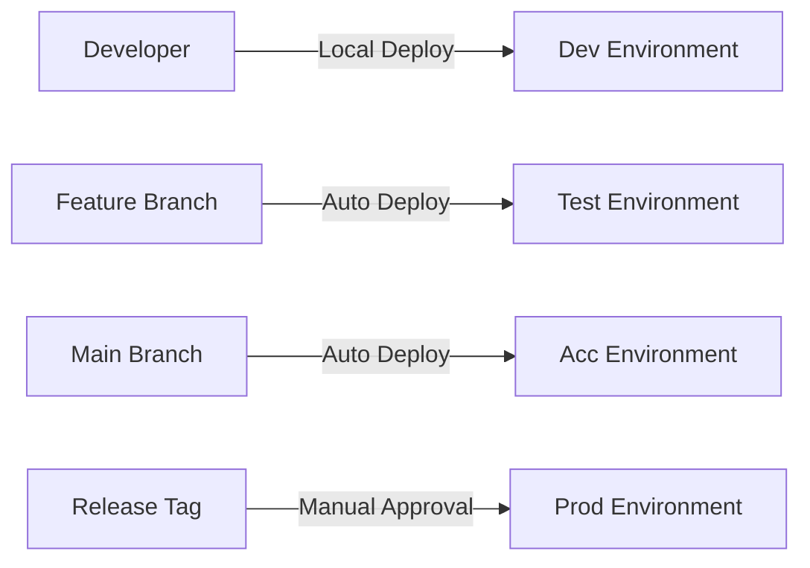

# 🏗️ Enterprise DTAP Architecture for GKE

This document outlines the architecture decisions and implementation patterns for a production-grade DTAP (Development, Testing, Acceptance, Production) environment on Google Cloud Platform with Kubernetes.

## 📋 Table of Contents

- [Architecture Overview](#architecture-overview)
- [Environment Separation Strategies](#environment-separation-strategies)
- [Recommended Architecture](#recommended-architecture)
- [Security & Compliance](#security--compliance)
- [CI/CD Pipeline Design](#cicd-pipeline-design)
- [Project Structure](#project-structure)
- [Implementation Details](#implementation-details)

## 🏗️ Architecture Overview

### **Current Implementation**

This project demonstrates **enterprise-grade multi-project DTAP architecture** with:

- ✅ **Production Project**: `gcp-training-329013` (actual)
- 📋 **Staging Projects**: Placeholder configurations for test/acc/prod
- 🚀 **Full CI/CD Pipeline**: GitHub Actions with environment promotions
- 🛡️ **Security Boundaries**: Complete isolation between environments

## 🎯 Environment Separation Strategies

### **Option 1: Single Cluster, Multi-Namespace** ❌

```
gcp-project-12345
└── single-gke-cluster
    ├── dev-namespace
    ├── test-namespace
    ├── acc-namespace
    └── prod-namespace
```

**Pros:**

- ✅ Lowest cost (single cluster)
- ✅ Simple management
- ✅ Shared resources efficiency

**Cons:**

- ❌ **Poor security isolation**
- ❌ **High blast radius** (cluster failure affects all environments)
- ❌ **Resource contention** between environments
- ❌ **Compliance challenges** (mixed data residency)
- ❌ **No environment-specific networking**

### **Option 2: Multi-Cluster, Single Project** ⚠️

```
gcp-project-12345
├── dev-gke-cluster
├── test-gke-cluster
├── acc-gke-cluster
└── prod-gke-cluster
```

**Pros:**

- ✅ Better isolation than namespaces
- ✅ Independent cluster scaling
- ✅ Moderate cost (shared project resources)
- ✅ Environment-specific cluster configurations

**Cons:**

- ⚠️ **Shared IAM policies** across environments
- ⚠️ **Common service accounts** create security risks
- ⚠️ **Shared networking** (VPCs, subnets)
- ⚠️ **Mixed billing** makes cost tracking difficult
- ⚠️ **Compliance gaps** for regulated workloads

### **Option 3: Multi-Project Architecture** ✅ **RECOMMENDED**

```
├── company-dev-project      → dev-gke-cluster
├── company-test-project     → test-gke-cluster
├── company-acc-project      → acc-gke-cluster
└── company-prod-project     → prod-gke-cluster
```

**Pros:**

- ✅ **Complete security isolation**
- ✅ **Independent IAM policies** per environment
- ✅ **Separate networking** (VPCs, firewall rules, DNS)
- ✅ **Environment-specific quotas** and limits
- ✅ **Compliance-ready** (SOC2, PCI-DSS, HIPAA)
- ✅ **Clear cost allocation** per environment
- ✅ **Minimal blast radius** (isolated failures)
- ✅ **Audit trail separation**

**Cons:**

- ❌ **Higher operational complexity**
- ❌ **Increased costs** (multiple clusters)
- ❌ **More Terraform state management**
- ❌ **Complex cross-environment networking** if needed

## 🎯 Recommended Architecture

### **Production-Ready Multi-Project Setup**

```mermaid
graph TB
    subgraph "GitHub Repository"
        A[Source Code]
        B[Terraform Configs]
        C[K8s Manifests]
    end

    subgraph "Dev Environment"
        D[company-dev-project]
        D1[dev-gke-cluster]
        D2[dev-vpc-network]
        D3[dev-specific-resources]
    end

    subgraph "Test Environment"
        E[company-test-project]
        E1[test-gke-cluster]
        E2[test-vpc-network]
        E3[test-specific-resources]
    end

    subgraph "Acceptance Environment"
        F[company-acc-project]
        F1[acc-gke-cluster]
        F2[acc-vpc-network]
        F3[acc-specific-resources]
    end

    subgraph "Production Environment"
        G[company-prod-project]
        G1[prod-gke-cluster]
        G2[prod-vpc-network]
        G3[prod-specific-resources]
    end

    A --> D
    A --> E
    A --> F
    A --> G
```



## 🛡️ Security & Compliance

### **Security Boundaries**

| Aspect                 | Multi-Namespace | Multi-Cluster | Multi-Project |
| ---------------------- | --------------- | ------------- | ------------- |
| **Network Isolation**  | ❌ Shared       | ⚠️ Limited    | ✅ Complete   |
| **IAM Separation**     | ❌ None         | ⚠️ Partial    | ✅ Full       |
| **Resource Isolation** | ❌ Weak         | ⚠️ Good       | ✅ Strong     |
| **Audit Separation**   | ❌ Mixed        | ⚠️ Partial    | ✅ Complete   |
| **Compliance Ready**   | ❌ No           | ⚠️ Limited    | ✅ Yes        |

### **Compliance Benefits - NOT VERIFIED, SHOULD BE CONFIRMED**

> Below are potential compliance benefits of multi-project architecture:

- **SOC 2 Type II**: Complete audit trail separation
- **PCI-DSS**: Network and data isolation
- **HIPAA**: PHI data segregation
- **ISO 27001**: Access control matrices per environment
- **GDPR**: Data residency and processing boundaries

### **Security Hardening**

```yaml
Per-Project Security Features:
  - Dedicated service accounts per environment
  - Environment-specific VPC networks and subnets
  - Isolated firewall rules and security policies
  - Separate Cloud KMS keys for encryption
  - Independent backup and disaster recovery
  - Environment-scoped monitoring and alerting
```

## 🚀 CI/CD Pipeline Design

### **Deployment Flow**



### **Environment Promotion Strategy**

| Environment     | Trigger           | Approval | Deploy Method                |
| --------------- | ----------------- | -------- | ---------------------------- |
| **Development** | Local push        | None     | Direct (./deploy_cluster.sh) |
| **Test**        | Feature branch PR | None     | GitHub Actions               |
| **Acceptance**  | Merge to main     | None     | GitHub Actions               |
| **Production**  | Release creation  | Manual   | GitHub Actions + Approval    |

### **Security Gates**

- **Branch Protection Rules** for main branch
- **Required PR Reviews** for all changes
- **Status Checks** must pass before merge
- **Manual Approval** required for production deployments
- **Deployment Windows** for production changes
- **Rollback Procedures** for each environment

## 📁 Project Structure

```
terraform/
├── README_ARCHITECTURE.md          # This file
├── dtap/
│   ├── dev/                        # Development environment
│   │   ├── main.tf                 # Actual dev configuration
│   │   ├── variables.tf            # Dev-specific variables
│   │   ├── terraform.tfvars        # Dev values
│   │   └── deploy_cluster.sh       # Local deployment script
│   ├── test/                       # Test environment
│   │   ├── main.tf                 # Test configuration
│   │   ├── variables.tf            # Test-specific variables
│   │   └── terraform.tfvars        # Test values
│   ├── acc/                        # Acceptance environment
│   │   ├── main.tf                 # Acc configuration
│   │   ├── variables.tf            # Acc-specific variables
│   │   └── terraform.tfvars        # Acc values
│   └── prod/                       # Production environment
│       ├── main.tf                 # Prod configuration
│       ├── variables.tf            # Prod-specific variables
│       └── terraform.tfvars        # Prod values
├── modules/                        # Shared Terraform modules
└── .github/workflows/              # CI/CD pipeline definitions
```

## 🔧 Implementation Details

### **Per-Environment Configuration**

Each environment maintains:

- **Independent Terraform State**: Prevents cross-environment impacts
- **Environment-Specific Variables**: Project IDs, regions, sizing
- **Dedicated Service Accounts**: Scoped permissions per environment
- **Custom Networking**: VPCs, subnets, firewall rules
- **Environment Tags**: For cost allocation and resource management

### **Cost Management**

```yaml
Cost Optimization Strategies:
  - GKE Autopilot: Pay only for running pod resources
  - Environment-specific node pools: Right-sized for workload
  - Scheduled scaling: Scale down non-prod during off-hours
  - Resource quotas: Prevent runaway costs per environment
  - Budget alerts: Monitoring and cost controls per project
```

### **Disaster Recovery**

- **Cross-Region Backups**: For production environments
- **Infrastructure as Code**: Complete environment recreation
- **Blue/Green Deployments**: Zero-downtime production updates
- **Database Backups**: Automated and tested restore procedures
- **Monitoring & Alerting**: Comprehensive observability stack

## 📋 Current Project Status

### **Active Environment**

- **Development**: `gcp-training-329013` (fully functional)
  - GKE Autopilot cluster
  - ArgoCD + Argo Rollouts
  - NGINX Ingress Controller
  - Online Boutique demo application
  - Platform RBAC with team management

### **Planned Environments** (Placeholder Configurations)

- **Test**: `company-test-project` (configuration ready)
- **Acceptance**: `company-acc-project` (configuration ready)
- **Production**: `company-prod-project` (configuration ready)

## 🎯 Benefits for Advanced Engineers

This architecture demonstrates:

### **Enterprise Patterns**

- **Multi-tenancy** with proper isolation
- **GitOps workflows** with ArgoCD integration
- **Infrastructure as Code** with Terraform
- **Security by design** with least-privilege access
- **Observability** with monitoring and logging

### **Best Practices**

- **Immutable infrastructure** deployment patterns
- **Progressive delivery** with canary deployments
- **Configuration management** with Kustomize
- **Secret management** with external secret operators
- **Policy as code** with Open Policy Agent integration

### **Operational Excellence**

- **Automated deployments** with GitHub Actions
- **Environment parity** across DTAP pipeline
- **Rollback strategies** and disaster recovery
- **Cost optimization** and resource management
- **Compliance** and audit readiness

## 🚀 Getting Started

1. **Review Architecture**: Understand the multi-project design
2. **Deploy Development**: Use `./deploy_cluster.sh` in `dtap/dev/`
3. **Explore CI/CD**: Review `.github/workflows/` for deployment patterns
4. **Scale Up**: Create additional projects for test/acc/prod when ready

---

This architecture provides a **production-ready foundation** for enterprise Kubernetes deployments while maintaining **security, scalability, and operational excellence**.

🎉 **Ready for Enterprise!** 🎉
