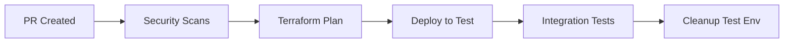
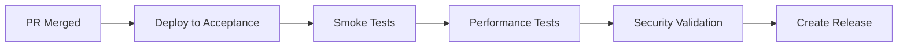
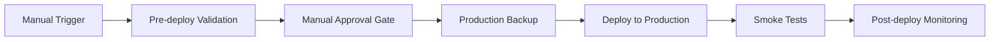

# DTAP Deployment Pipeline Guide

## Overview

This document provides a complete guide for the DTAP (Development, Test, Acceptance, Production) deployment pipeline using GitHub Actions, Terraform, and Google Cloud Platform.

## 📋 Table of Contents

- [Architecture Overview](#architecture-overview)
- [Environment Setup](#environment-setup)
- [GitHub Actions Workflows](#github-actions-workflows)
- [Security Configuration](#security-configuration)
- [Deployment Process](#deployment-process)
- [Monitoring and Validation](#monitoring-and-validation)
- [Troubleshooting](#troubleshooting)

## 🏗️ Architecture Overview

### Multi-Project Strategy

Our DTAP pipeline uses a **multi-project approach** for maximum security and isolation:

```
📁 GCP Projects Structure
├── gcp-training-329013 (Development)
├── company-test-project (Test)
├── company-acc-project (Acceptance)
└── company-prod-project (Production)
```

### Environment Characteristics

| Environment    | Trigger          | Approval              | Purpose           | Isolation Level   |
| -------------- | ---------------- | --------------------- | ----------------- | ----------------- |
| **Dev**        | Manual/Local     | None                  | Local development | Single project    |
| **Test**       | PR to main       | Automatic             | Feature testing   | Dedicated project |
| **Acceptance** | Push to main     | Manual                | User acceptance   | Dedicated project |
| **Production** | Release workflow | Manual + Stakeholders | Live system       | Dedicated project |

## 🚀 Environment Setup

### Prerequisites

1. **GCP Projects**: Create separate projects for each environment
2. **Service Accounts**: Create deployment service accounts with appropriate IAM roles
3. **GitHub Secrets**: Configure repository secrets for each environment
4. **Terraform State Storage**: Set up Cloud Storage buckets for Terraform state

### Required GitHub Secrets

```bash
# Development (existing project)
GCP_DEV_SA_KEY          # Service account key for dev deployments

# Test Environment
GCP_TEST_SA_KEY         # Service account key for test deployments
TEST_PROJECT_ID         # GCP project ID for test

# Acceptance Environment
GCP_ACC_SA_KEY          # Service account key for acceptance deployments
ACC_PROJECT_ID          # GCP project ID for acceptance

# Production Environment
GCP_PROD_SA_KEY         # Service account key for production deployments
PROD_PROJECT_ID         # GCP project ID for production

# Notification Webhooks (optional)
SLACK_WEBHOOK_URL       # Slack webhook for notifications
# Need to finish setup/config and test....
```

### Service Account IAM Roles

Each environment's service account needs these roles:

```bash
# Core GKE and Compute roles
roles/container.admin
roles/compute.admin
roles/iam.serviceAccountUser

# Storage and networking
roles/storage.admin
roles/servicenetworking.networkAdmin

# Monitoring and logging
roles/monitoring.admin
roles/logging.admin

# Security
roles/securitycenter.admin
roles/binaryauthorization.attestorsAdmin
```

## 📋 GitHub Actions Workflows

### 1. Test Environment (`deploy-test.yml`)

**Trigger**: Pull request to `main` branch

**Flow**:



**Features**:

- ✅ Automatic deployment on PR creation
- ✅ Security scanning with Trivy
- ✅ Terraform plan and apply
- ✅ Automated integration tests
- ✅ Environment cleanup after testing
- ✅ Cost optimization (preemptible nodes)

### 2. Acceptance Environment (`deploy-acceptance.yml`)

**Trigger**: Push to `main` branch (merged PR)

**Flow**:



**Features**:

- ✅ Deployment on successful merge to main
- ✅ Comprehensive testing suite
- ✅ Performance validation
- ✅ Automatic release creation
- ✅ User acceptance testing environment
- ✅ Staging-grade infrastructure

### 3. Production Environment (`deploy-production.yml`)

**Trigger**: Manual workflow dispatch with release tag

**Flow**:



**Features**:

- ✅ Manual trigger with required approvals
- ✅ Pre-deployment validation
- ✅ Production backup before deployment
- ✅ Zero-downtime deployment strategy
- ✅ Comprehensive post-deployment monitoring
- ✅ Enterprise-grade security and compliance

## 🔒 Security Configuration

### Environment Protection Rules

Configure GitHub environment protection rules:

```yaml
# .github/environments/production-approval.yml
protection_rules:
  - type: required_reviewers
    required_reviewers:
      - team:platform-team
      - team:security-team
  - type: wait_timer
    wait_timer: 5 # 5 minutes
```

### Network Security

Production environment includes:

- **Private GKE Cluster**: Nodes have no external IPs
- **Network Policies**: Calico-based microsegmentation
- **Authorized Networks**: Restricted master access
- **Workload Identity**: Secure pod-to-GCP authentication
- **Binary Authorization**: Container image attestation

### Secrets Management

```bash
# Use Google Secret Manager for production secrets
gcloud secrets create argocd-admin-password --data="secure-password"
gcloud secrets create grafana-admin-password --data="production-password"
```

## 📦 Deployment Process

### Development Workflow

```bash
# Local development - deploy to dev environment
cd terraform/dtap/dev
terraform init
terraform plan -var="gcp_project_id=gcp-training-329013"
terraform apply -auto-approve
```

### Test Environment Workflow

1. **Create Feature Branch**:

   ```bash
   git checkout -b feature/new-functionality
   git push origin feature/new-functionality
   ```

2. **Open Pull Request**:

   - GitHub Actions automatically deploys to test environment
   - Runs security scans and integration tests
   - Provides feedback on PR

3. **Review and Merge**:
   - Code review by team members
   - Automated tests must pass
   - Merge triggers acceptance deployment

### Production Deployment

1. **Navigate to GitHub Actions**:

   ```
   Repository → Actions → "🏭 Deploy to Production Environment"
   ```

2. **Fill Required Information**:

   ```
   Release Tag: v1.2.3
   Maintenance Window: 2024-01-15 02:00 UTC
   Rollback Plan: ✅ Confirmed
   Stakeholder Approval: ✅ Obtained
   ```

3. **Approve Production Deployment**:
   - Manual approval gate requires authorized reviewers
   - Production backup created automatically
   - Zero-downtime deployment executed

## 📊 Monitoring and Validation

### Post-Deployment Validation

Each environment automatically validates:

```bash
# Cluster Health
kubectl get nodes
kubectl get pods --all-namespaces

# Service Connectivity
kubectl get services --all-namespaces
kubectl get ingress --all-namespaces

# Platform Services
kubectl get pods -n argocd
kubectl get pods -n monitoring
kubectl get pods -n ingress-nginx
```

### Production Monitoring

Production environment includes comprehensive monitoring:

- **Prometheus**: Metrics collection and alerting
- **Grafana**: Visualization dashboards
- **AlertManager**: Alert routing and escalation
- **Fluent Bit**: Log aggregation to Cloud Logging
- **ArgoCD**: GitOps deployment monitoring

### SLA Monitoring

```yaml
# Production SLA Targets
Availability: 99.9%
Response Time: < 200ms (95th percentile)
Error Rate: < 0.1%
Recovery Time: < 5 minutes
```

## 🎯 Best Practices

### Terraform State Management

```hcl
# Each environment uses separate state storage
terraform {
  backend "gcs" {
    bucket = "company-terraform-state-{environment}"
    prefix = "terraform/state/{environment}"
  }
}
```

### Resource Naming Convention

```
Resource Format: {service}-{environment}-{resource-type}
Examples:
- online-boutique-prod-vpc
- online-boutique-test-cluster
- online-boutique-acc-subnet
```

### Cost Optimization

| Environment    | Cost Optimization Strategy                |
| -------------- | ----------------------------------------- |
| **Dev**        | Preemptible nodes, auto-shutdown          |
| **Test**       | Ephemeral (created/destroyed per PR)      |
| **Acceptance** | Scheduled shutdown outside business hours |
| **Production** | Right-sized instances, autoscaling        |

## 🔧 Troubleshooting

### Common Issues

#### 1. Terraform State Lock

```bash
# Release lock if deployment fails
terraform force-unlock <LOCK_ID>
```

#### 2. GKE Cluster Access

```bash
# Update kubectl credentials
gcloud container clusters get-credentials <cluster-name> \
  --region <region> --project <project-id>
```

#### 3. ArgoCD Access

```bash
# Get ArgoCD admin password
kubectl get secret argocd-initial-admin-secret \
  -n argocd -o jsonpath='{.data.password}' | base64 -d
```

#### 4. Helm Release Issues

```bash
# List all Helm releases
helm list --all-namespaces

# Rollback problematic release
helm rollback <release-name> <revision> -n <namespace>
```

### Emergency Procedures

#### Production Rollback

```bash
# 1. Rollback via ArgoCD UI or CLI
argocd app rollback online-boutique --revision <previous-revision>

# 2. Database rollback (if applicable)
# Follow your database rollback procedures

# 3. Notify stakeholders
# Use incident management process
```

## 📞 Support and Contacts

### Escalation Matrix

| Level | Contact           | Response Time |
| ----- | ----------------- | ------------- |
| L1    | Platform Team     | 15 minutes    |
| L2    | Senior DevOps     | 30 minutes    |
| L3    | Architecture Team | 1 hour        |
| L4    | CTO Office        | 2 hours       |

### Documentation Links

- [Terraform Documentation](https://www.terraform.io/docs)
- [GKE Documentation](https://cloud.google.com/kubernetes-engine/docs)
- [ArgoCD Documentation](https://argo-cd.readthedocs.io)
- [GitHub Actions Documentation](https://docs.github.com/en/actions)

---

## 🎉 Conclusion

This DTAP pipeline provides:

✅ **Enterprise-grade security** with multi-project isolation  
✅ **Automated testing** at every stage  
✅ **Manual approval gates** for production safety  
✅ **Comprehensive monitoring** and observability  
✅ **Zero-downtime deployments** for production  
✅ **Cost optimization** across all environments  
✅ **Full GitOps workflow** with ArgoCD integration

The pipeline scales from development to production while maintaining security, compliance, and operational excellence standards suitable for enterprise environments.

---

_Last updated: January 2024_  
_Version: 1.0_
